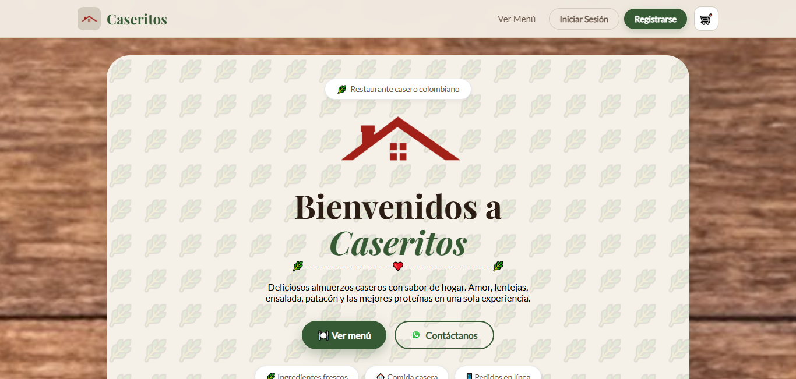
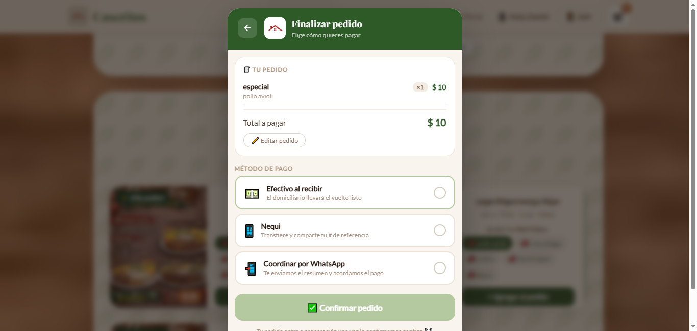
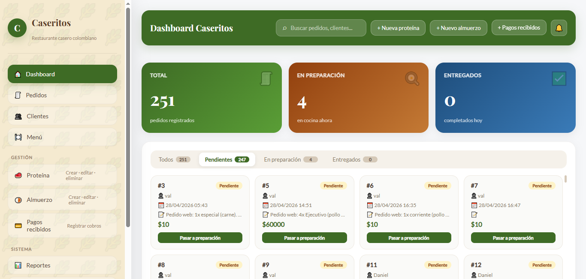
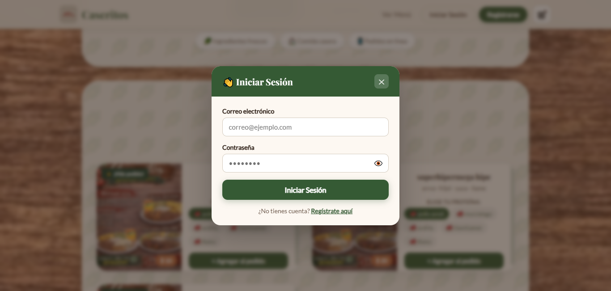

<h1 align="center">UTB Caseritos</h1>

<p align="center">
  
  
  
</p>

<p align="center">
  Sistema web real para un negocio local de almuerzos en Colombia, pensado para ordenar pedidos dispersos por WhatsApp, centralizar la operacion y dejar trazabilidad tecnica de punta a punta.
</p>

## Demo

- API publica: `https://utb-caseritos.onrender.com`
- Frontend publico: `https://utb-caseritos.vercel.app`
- Documentacion API: `https://utb-caseritos.onrender.com/docs`

## Problema vs Solucion

| Problema real | Solucion implementada | Habilidad fullstack demostrada |
| --- | --- | --- |
| Los pedidos llegaban por WhatsApp y se perdia el control operativo. | El checkout construye el pedido, calcula el total y lo envia a la API. | Diseno de flujo de compra y orquestacion frontend-backend. |
| Se necesitaba bloquear paneles administrativos. | Angular usa `AuthGuard` y `RoleGuard`, y el backend valida JWT por rol. | Seguridad aplicada en cliente y servidor. |
| El negocio maneja menu, pedidos y pagos en una sola operacion. | La API modela usuarios, proteinas, tipos de almuerzo, pedidos, detalles y pagos. | Modelado de datos y logica transaccional. |

## Stack Tecnologico

- Angular `21.2.x` con SSR, hydration y router.
- TypeScript `~5.9.2`.
- RxJS `~7.8.0`.
- Angular Material `21.2.8`.
- Bootstrap `5.3.8`.
- FastAPI.
- Uvicorn.
- SQLAlchemy.
- psycopg2-binary.
- python-dotenv.
- python-jose.
- passlib `1.7.4` con bcrypt `4.0.1`.
- Python `3.11.8`.
- PostgreSQL en Supabase.
- Render para despliegue de la API.

## Flujo de Autenticacion

### Backend

- `POST /auth/login` usa `OAuth2PasswordRequestForm`, por eso el frontend envía `application/x-www-form-urlencoded`.
- El backend busca el usuario por email, valida la contrasena con hashing y genera un JWT.
- El token incluye `sub` con el email, `role` y `exp`.
- `get_current_user` decodifica el token, busca el usuario en la base de datos y expone `user`, `role` y `email`.
- `require_admin` permite solo `admin`.
- `require_cliente` permite `cliente` y tambien `admin`.

### Angular

- `AuthService.login()` envia `username` y `password` al backend.
- El servicio decodifica el JWT en el cliente, guarda `token`, `role` y `userName` en `localStorage` y restaura sesion al recargar.
- `authInterceptor` agrega `Authorization: Bearer <token>` solo a requests que van a `API_BASE_URL`.
- `AuthGuard` protege la ruta `/admin`.
- `RoleGuard` valida el rol requerido desde `route.data.role`.

## Sistema de Roles

- `Admin` corresponde al valor de rol `admin` y, en la regla de negocio del login, al `rol_id = 1`.
- `Cliente` corresponde al valor de rol `cliente` y, en la regla de negocio del login, al `rol_id = 2`.
- `Admin` puede gestionar usuarios, proteinas, tipos de almuerzo, pedidos, detalles y pagos.
- `Cliente` puede crear su pedido, ver su historial y trabajar con sus propios pagos y detalles visibles.
- El panel administrativo solo se abre si el token es valido y el rol coincide.

## Logica de Negocio

- El pedido se crea con estado inicial `pendiente`.
- Los estados validos en backend son `pendiente`, `en preparacion` y `entregado`.
- El dashboard administrativo permite mover pedidos entre `pendiente`, `en preparacion` y `entregado`.
- El checkout soporta `efectivo` y `nequi` como metodos persistidos en la API.
- Si el metodo es `nequi`, la referencia es obligatoria.
- Si el metodo es `efectivo`, el frontend calcula billetes, total entregado, faltante y vuelto para facilitar la entrega contraentrega.
- El checkout tambien puede generar un mensaje por WhatsApp como canal auxiliar, pero la persistencia del pedido en la API usa `efectivo` o `nequi`.
- `DetallePedido` recalcula el total del pedido cuando se crea, actualiza o elimina un detalle.

## Modelo de Datos

| Entidad | Campos clave | Proposito |
| --- | --- | --- |
| `rol` | `id`, `nombre` | Define el tipo de acceso del usuario. |
| `usuario` | `id`, `nombre`, `lastname`, `password`, `address`, `phone`, `email`, `rol_id` | Identidad y autenticacion del cliente o administrador. |
| `proteina` | `id`, `nombre`, `avaliable` | Catalogo de proteinas disponibles para el menu. |
| `tipoalmuerzo` | `id`, `nombre`, `descripcion`, `precio` | Catalogo de almuerzos y precios. |
| `pedido` | `id`, `fecha_creacion`, `estado`, `sugerencia`, `total`, `usuario_id`, `pago_id` | Cabecera del pedido. |
| `detallepedido` | `id`, `pedidoid`, `proteinaid`, `tipalmuerzoid`, `cantidad`, `precio_unitario`, `total` | Lineas que componen cada pedido. |
| `pago` | `id`, `metodopago`, `diadelpago`, `monto`, `referencia` | Registro del pago asociado al pedido. |

## API Reference

| Endpoint | Metodo | Acceso | Descripcion |
| --- | --- | --- | --- |
| `/` | `GET` | Publico | Verifica que la API este activa. |
| `/auth/login` | `POST` | Publico | Autentica al usuario y retorna JWT, rol y nombre. |
| `/auth/registro` | `POST` | Publico | Registra un nuevo cliente con `rol_id = 2`. |
| `/usuario/addUsuario` | `POST` | Admin | Crea un usuario desde el panel. |
| `/usuario/listUsuarios` | `GET` | Admin | Lista todos los usuarios. |
| `/usuario/getUsuario?id=` | `GET` | Admin | Obtiene un usuario por id. |
| `/usuario/actualizarUsuario?id=` | `PUT` | Admin | Actualiza un usuario. |
| `/usuario/deleteUsuario?id=` | `DELETE` | Admin | Elimina un usuario. |
| `/proteina/crearProteina` | `POST` | Admin | Crea una proteina. |
| `/proteina/listProteinas` | `GET` | Publico | Lista las proteinas disponibles. |
| `/proteina/getProteina?id=` | `GET` | Publico | Obtiene una proteina por id. |
| `/proteina/actualizarProteina?id=` | `PUT` | Admin | Actualiza una proteina. |
| `/proteina/borrarProteina?id=` | `DELETE` | Admin | Elimina una proteina. |
| `/tipoalmuerzo/crearTipoAlmuerzo` | `POST` | Admin | Crea un tipo de almuerzo. |
| `/tipoalmuerzo/listTiposAlmuerzo` | `GET` | Publico | Lista los tipos de almuerzo. |
| `/tipoalmuerzo/getTipoAlmuerzo?id=` | `GET` | Publico | Obtiene un tipo de almuerzo por id. |
| `/tipoalmuerzo/actualizarTipoAlmuerzo?id=` | `PUT` | Admin | Actualiza un tipo de almuerzo. |
| `/tipoalmuerzo/borrarTipoAlmuerzo?id=` | `DELETE` | Admin | Elimina un tipo de almuerzo. |
| `/pedido/crearPedidoManual` | `POST` | Admin | Crea un pedido manualmente. |
| `/pedido/crearPedido` | `POST` | Cliente/Admin | Crea un pedido desde el checkout con pago y detalles. |
| `/pedido/listPedidos` | `GET` | Cliente/Admin | Lista pedidos visibles para el usuario autenticado. |
| `/pedido/getPedido?id=` | `GET` | Cliente/Admin | Obtiene un pedido visible por id. |
| `/pedido/actualizarPedido?id=` | `PUT` | Cliente/Admin | Actualiza un pedido visible. |
| `/pedido/actualizarEstado?id=&estado=` | `PATCH` | Admin | Cambia el estado operativo del pedido. |
| `/pedido/borrarPedido?id=` | `DELETE` | Cliente/Admin | Elimina un pedido visible. |
| `/detallesPedido/crearDetallesPedido` | `POST` | Admin | Crea una linea de detalle de pedido. |
| `/detallesPedido/listDetallesPedidos` | `GET` | Cliente/Admin | Lista detalles visibles para el usuario autenticado. |
| `/detallesPedido/getDetallesPedido?id=` | `GET` | Cliente/Admin | Obtiene un detalle por id. |
| `/detallesPedido/actualizarDetallesPedido?id=` | `PUT` | Cliente/Admin | Actualiza un detalle y recalcula el total. |
| `/detallesPedido/borrarDetallesPedido?id=` | `DELETE` | Cliente/Admin | Elimina un detalle y recalcula el total. |
| `/Pago/crearPago` | `POST` | Admin | Crea un pago manual. |
| `/Pago/listPagos` | `GET` | Cliente/Admin | Lista pagos visibles para el usuario autenticado. |
| `/Pago/getPago?id=` | `GET` | Cliente/Admin | Obtiene un pago por id. |
| `/Pago/actualizarPago?id=` | `PUT` | Cliente/Admin | Actualiza un pago visible. |
| `/Pago/borrarPago?id=` | `DELETE` | Cliente/Admin | Elimina un pago visible. |

## Screenshots

<table>
  <tr>
    <td align="center">
      <strong>Home</strong><br />
      
    </td>
    <td align="center">
      <strong>Checkout</strong><br />
      
    </td>
  </tr>
  <tr>
    <td align="center">
      <strong>Admin Dashboard</strong><br />
      
    </td>
    <td align="center">
      <strong>Login / Registro</strong><br />
      
    </td>
  </tr>
</table>

## Guia de Instalacion

### Backend

```bash
cd backend
python -m pip install -r requirements.txt
Copy-Item .env.example .env
uvicorn main:app --reload
```

### Frontend

```bash
cd frontend
npm install
npm start
```

## Estructura del Proyecto

<details>
<summary>Ver estructura de carpetas</summary>

```text
backend/
  auth/
    dependencies.py
    hashing.py
    jwt.py
  models/
    base.py
    DetallePedido.py
    Pago.py
    Pedido.py
    Proteina.py
    Rol.py
    TipoAlmuerzo.py
    Usuario.py
  routes/
    auth.py
    DetallePedido_routes.py
    Pago_routes.py
    Pedido_routes.py
    Proteina_routes.py
    TipoAlmuerzo_routes.py
    Usuario_routes.py
  schemas/
    DetallePedido_schemas.py
    Login_schema.py
    Pago_schemas.py
    Pedido_schemas.py
    Proteina_schemas.py
    Roles_schemas.py
    TipoAlmuerzo_schemas.py
    Usuario_schemas.py
  db.py
  main.py
  Procfile
  runtime.txt

frontend/
  src/app/
    components/
      admin/
      home/
      login/
      registrar/
    guards/
    routes/
    services/
  src/assets/
  src/main.ts
  src/main.server.ts
  src/server.ts
  angular.json
  package.json
```

</details>

## Despliegue

- API en Render con `web: uvicorn main:app --host 0.0.0.0 --port $PORT`.
- Base de datos PostgreSQL en Supabase.
- Frontend Angular publicado como aplicacion web y consumiendo `API_BASE_URL`.

## Licencia

Proyecto distribuido bajo licencia MIT.
